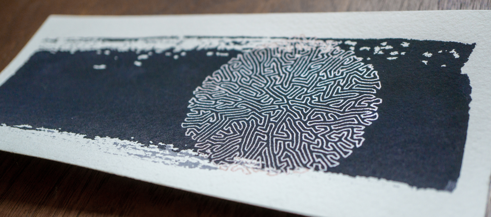
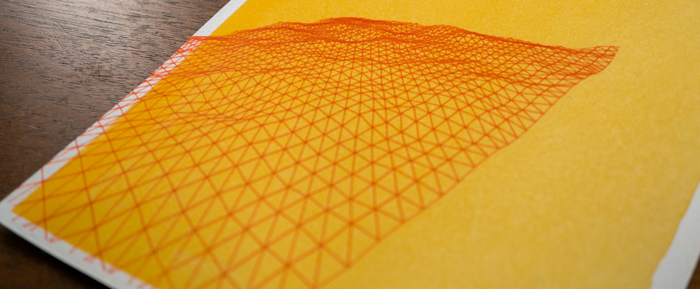
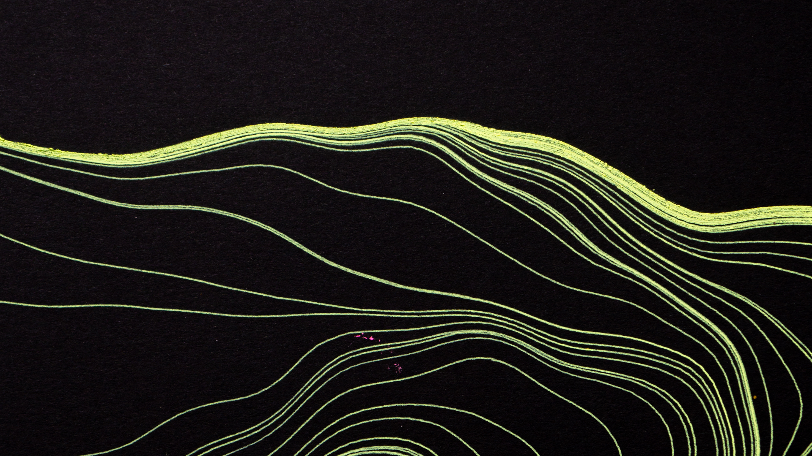

### Once again I am plotting.

I'm plotting again. That is to say: I am using my AxiDraw pen plotter to make drawings of things I generate using Clojure. I've been creating generative art for some time now, but only recently started working in Clojure. TL;DR: it's great!

This is something I've done more or less as long as I've used computers, starting way back in the 90s when I was a pre-teen writing my Geocities fanpages. But I really started getting into it once I learned about the AxiDraw.

My first exposure to pen plotters was in middle school when I took a "Tech Ed" class, one of my favorites because it had the best toys. I got to play with a programmable robot, build balsa wood bridge designs, decipher Morse code over HAM radio. The class also had an industrial pen plotter donated by a local printer company. I was fascinated by the whizzing mechanical arm that could take a felt tip pen and draw what was on the computer screen on a big piece of paper. The combination of precision and physical markmaking made a deep impression on me. The teacher watched me like a hawk as I used it. "These things cost like ten grand new. If you break this one, we can't get another," he told me. I promised to be very careful.

{: .full-width}

Later, I learned about the AxiDraw, an affordable consumer-grade pen plotter. After completing a BFA in drawing, I felt I had been exposed to the full range of possibilities for making drawings, but finding the AxiDraw felt new and old at the same time. Memories of my childhood Tech Ed class rushed over me. I was pleased to find that the once out of reach toy was now very reasonably priced.

As a drawing major I spent countless hours drawing with charcoal, ink, pastel, every material under the sun. I loved selecting paper and material, playing with combinations until something really gorgeous emerged. The pen plotter adds a new dimension to this exploration: the dimension of repeatability. Not only the ability to repeat entire drawings, but to build drawings of perfectly identical patterns. The plotter gives me the ability to draw with absolute precision. I'm fascinated by the question posed by a pen plotter: "What can a machine draw that a human being can't?" - and the counter to that question - "What can a human draw that a machine can't?"

All this to say that when I write code for generative art, I'm exclusively generating art for my pen plotter, which poses some technical limitations. Limitations, as any artist knows, are a door to creativity. The main one is color. The AxiDraw is limited to a single pen at a time; it does not have any mechanism for changing pens. Thus, the SVGs I generate are always black-on-white. I think of them more akin to my linocut blocks: a master that can be rendered in any color I choose at time of printing. Actually using the AxiDraw is closer to printmaking than any other artistic discipline. The image-creation is separate from the print-creation and both can be iterated upon.

{: .full-width}

Right now I'm iterating on image-creation. I have something like a half dozen repos for generative art at this point. Each is sort of like a sketchbook, a collection of ideas, tooling, and works-in-progress. Generally I stop using an old repo and start a new one when I change libraries or programming languages. When I first started writing code for the AxiDraw, I attempted to roll my own SVG library in Elixir, the language I used everyday at work. I learned a lot about SVGs, but didn't make much art. Later, I discovered the Processing library and used that in both its native Java and the Javascript port. I produced a lot more art, but I often found myself frustrated writing Java. Most recently I started a new job and now most of my work coding is in Clojure. I'm using the Quil library, which is a Clojure wrapper for the Processing library. Having access to Processing's vast library of art functions and being able to reason about it in the language of my choice is a special pleasure after all the time spent futzing about figuring out how to encode xml and Googling Java errors. Clojure has the added bonus of the REPL, and one of the big selling points of Quil is the ability to modify the image I'm creating and see updates instantly.

My generative art process is scrappy by design. My generative art repos are a huge hodgepodge of other people's code, ideas copied from blogs, library functions stuck together with glue or hastily rewritten in my language of choice. As I'm coding up new designs, I'm printing them using the AxiDraw and modifying them until the resulting drawing catches my attention in some way. My first few Quil sketches were very imperative, as generating a still image suitable for printing doesn't require much in the way of abstraction. But as one starts to create work, preferences emerge. Right now I'm not really chasing any specific idea or image, I'm playing with Quil and seeing what happens. Abstraction has crept in, as has state management. Turns out I prefer to create animations, having parameters update semi-randomly and manually saving any frames that interest me as they happen. It's more fun to think of my Quil sketch as a toy more like an image synthesizer, a state machine with a lot of knobs and dials I can fiddle with to create something fun.

{: .full-width}

Quil sketches are self-contained: usually a single file, generally under 500 lines of code. They're highly disposable in a way production code isn't. At some point I may introduce some more abstraction into my Quil repo, most likely to handle some of the SVG export that is already calcifying into a library function. Right now I'm still in the mess around stage; I don't mind copy pasting all over the place while I'm still figuring stuff out.

Exploration is an odd task, seemingly un-optimizable. Right now I'm throwing a lot of different ideas at the wall and seeing what sticks. I keep a sketchbook of various ideas pre-code and perhaps a tenth of them become code. As I work on that code, sometimes it never gets to the point where I can actually render an SVG, and sometimes it goes beyond as I discover that the SVG I wanted to render was much less interesting than the one some buggy code spat out. AI is fun for this sort of thing because sometimes it misunderstands me in a particularly interesting way and then I branch off and play with that instead of my original idea. I'm not sure where I'm going with any of it. Instead, I just aim to play around. Clojure is very very good for this. I can see why it has been picked up by many generative artists.
